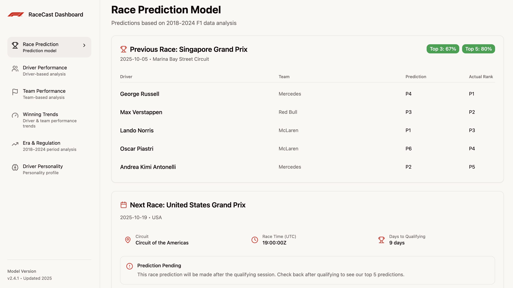

# 🏎️ RaceCast - F1 Analytics Dashboard

**RaceCast** is a comprehensive Formula 1 analytics dashboard that combines machine learning predictions with historical performance analysis. Built with modern web technologies, it provides real-time race predictions, driver performance insights, and strategic analysis for F1 enthusiasts and professionals.



## ✨ Features

### 🏆 Race Prediction Engine
- **ML-Powered Predictions**: Advanced XGBoost models trained on 3,318+ driver-race combinations
- **Real-time Accuracy Tracking**: Monitor prediction performance with top-3 and top-5 accuracy metrics
- **Live Race Updates**: Automatic updates during race weekends with smart caching strategies

### 📊 Performance Analytics
- **Driver Performance**: Comprehensive analysis of individual driver capabilities across different conditions
- **Constructor Performance**: Team-based analytics with historical standings and trends
- **Era & Regulation Analysis**: Compare performance across different F1 regulation periods (2018-2021 vs 2022+)

### 🧠 Advanced Insights
- **Driver Personality Profiles**: AI-driven personality analysis and racing archetypes
- **Winning Trends**: Historical performance trends and strategic patterns for drivers and teams
- **Era & Regulation Analysis**: Compare performance across different F1 regulation periods

## 🛠️ Technology Stack

### Frontend
- **Framework**: Next.js 15.2.4 with React 19
- **Styling**: Tailwind CSS with custom design system
- **UI Components**: Radix UI primitives with custom styling
- **State Management**: Zustand for global state
- **Data Fetching**: TanStack Query (React Query) with smart caching
- **Charts**: Recharts for data visualization
- **Icons**: Lucide React

### Backend & Data
- **Database**: Neon PostgreSQL (serverless)
- **API Integration**: Ergast F1 API for live data
- **ML Backend**: Python-based prediction API (deployed on Render)
- **Data Sources**: Enhanced F1 dataset (2018-2025) with FastF1 telemetry

### Development & Deployment
- **Runtime**: Bun 1.1.30 (package manager)
- **Deployment**: Vercel with edge functions
- **Cron Jobs**: Automated prediction updates (Saturdays 7 PM) and result updates (Sundays 8 PM)
- **Analytics**: Vercel Analytics integration

## 📈 Dataset Overview

The application leverages a comprehensive F1 dataset featuring:

- **3,318 driver-race combinations** across 8 seasons (2018-2025)
- **110 total features** combining Ergast API and FastF1 telemetry data
- **166 races** with 43 unique drivers
- **71.3% FastF1 telemetry coverage** for advanced performance metrics
- **Real-time integration** with official F1 data sources

## 🚀 Getting Started

### Prerequisites
- [Bun](https://bun.sh) 1.1.30 or later
- Node.js 18+ (if not using Bun)
- Neon PostgreSQL database
- API key for the prediction backend

### Installation

1. **Clone the repository**
   ```bash
   git clone <repository-url>
   cd racecast_frontend
   ```

2. **Install dependencies**
   ```bash
   bun install
   ```

3. **Environment Setup**
   Create a `.env.local` file with the following variables:
   ```env
   NEXT_PUBLIC_DATABASE_URL=your_neon_database_url
   API_KEY=your_prediction_api_key
   ```

4. **Run the development server**
   ```bash
   bun dev
   ```

5. **Open your browser**
   Navigate to [http://localhost:3000](http://localhost:3000)

### Production Deployment

The application is optimized for deployment on Vercel:

1. **Deploy to Vercel**
   ```bash
   vercel --prod
   ```

2. **Configure Environment Variables**
   - Set `NEXT_PUBLIC_DATABASE_URL` in Vercel project settings
   - Set `API_KEY` for prediction backend access

3. **Cron Jobs**
   The application automatically configures cron jobs for:
   - Race predictions (Saturdays at 7 PM)
   - Result updates (Sundays at 8 PM)

## 📱 Application Structure

```
racecast_frontend/
├── app/                    # Next.js app directory
│   ├── api/cron/          # Cron job endpoints
│   ├── layout.tsx         # Root layout
│   └── page.tsx           # Main dashboard
├── components/            # React components
│   ├── ui/               # Reusable UI components
│   ├── race-prediction.tsx
│   ├── driver-performance.tsx
│   ├── constructor-performance.tsx
│   ├── era-regulation.tsx
│   ├── driver-personality.tsx
│   └── winning-trends.tsx
├── lib/                  # Utility libraries
│   ├── neon-client.ts    # Database client
│   ├── race-store.ts     # Zustand store
│   └── era-analysis.ts   # Data analysis utilities
├── docs/                 # Documentation
│   ├── api_documentation.md
│   ├── data_sources.md
│   └── enhanced_dataset_documentation.md
└── public/              # Static assets
```

## 🔧 Configuration

### Caching Strategy
The application implements intelligent caching based on race calendar:
- **Race weekends**: 3-minute cache with 15-minute refresh intervals
- **Normal days**: 30-minute cache
- **Season end**: 24-hour cache
- **Live season (2025)**: 5-minute cache with focus refresh
- **Historical data**: 10-minute cache

### Data Sources Policy
- **2025 (live season)**: Ergast API for official standings and results
- **2018-2024**: Enhanced dataset for comprehensive analytics
- **Automatic fallback**: Seamless switching between data sources

## 📊 API Integration

### RaceCast Prediction API
- **Base URL**: `https://racecast-backend.onrender.com`
- **Authentication**: API key required
- **Endpoints**:
  - `GET /healthz` - Health check
  - `GET /last_race` - Last race information
  - `POST /predict` - Generate race predictions

### Ergast F1 API
- **Base URL**: `https://api.jolpi.ca/ergast/`
- **No authentication required**
- **Real-time F1 data**: Results, standings, race information

## 🤝 Contributing

1. Fork the repository
2. Create a feature branch (`git checkout -b feature/amazing-feature`)
3. Commit your changes (`git commit -m 'Add amazing feature'`)
4. Push to the branch (`git push origin feature/amazing-feature`)
5. Open a Pull Request

## 📄 License

This project is licensed under the GNU General Public License v3.0 (GPL-3.0) - see the [LICENSE](LICENSE) file for details.

**Important:** GPL v3 requires that any derivative works must also be open source and licensed under GPL v3 or compatible license.

## 🙏 Acknowledgments

- **Ergast API** for comprehensive F1 historical data
- **FastF1** for advanced telemetry and session data
- **Formula 1** for the incredible sport and data
- **Vercel** for seamless deployment and hosting
- **Neon** for serverless PostgreSQL database

---

**Built with ❤️ for F1 fans and data enthusiasts**

*Model Version: v2.4.1 • Updated 2025*
